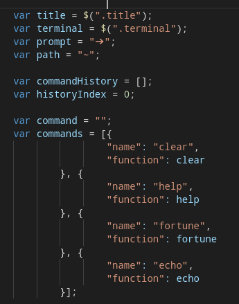
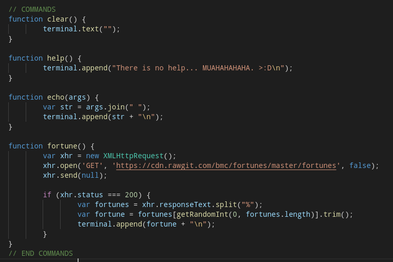

# OpenTerm
OpenTerm is a web based terminal app where you can try different terminal commands

## How it works?
OpenTerm is working purely on js.We have a file `index.js` in js folder which is the backbone of the website.
  
Here cammands array contains the commands,each element in the array is the commands which can be executed.when a command is used it calls the function associated with it.
  
The defintion of each command is given as in the above picture.

## How to contribute?

* `index.html` and `css/style.css` contains the UI part
* js/index.js` contains the commands and other features.
* To add a new command define the command in the commands array and its definition in the function as given in the screenshot.

## Commands :
* help
* echo
* fortune
* clear
